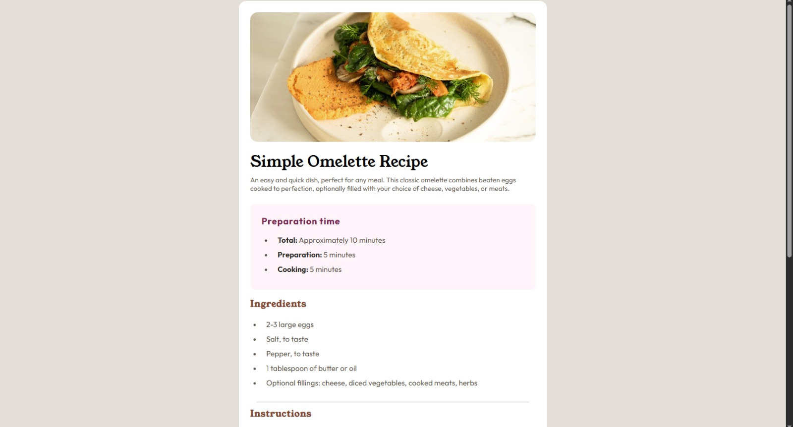
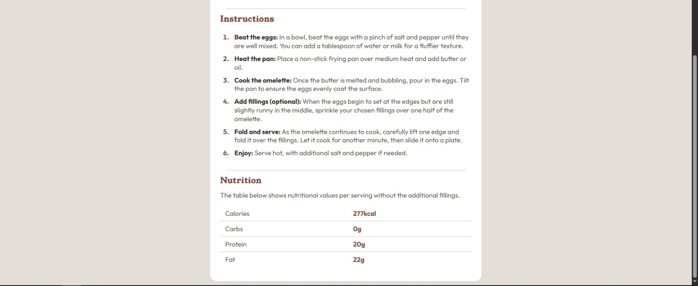
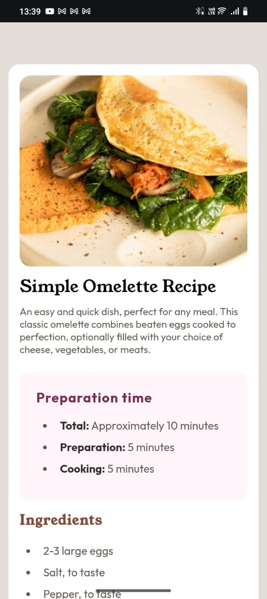
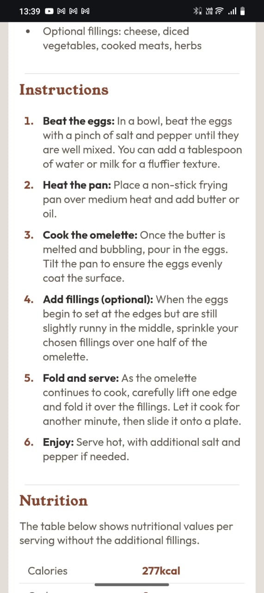
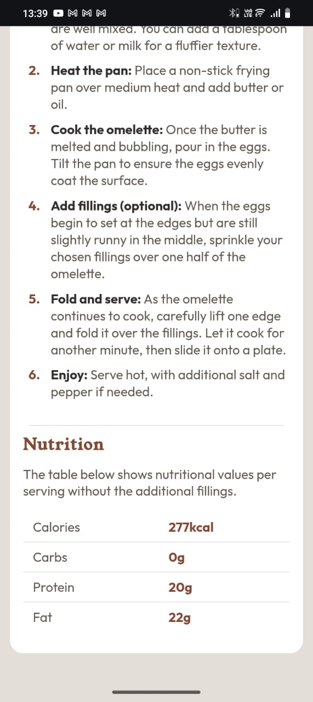

# Frontend Mentor - Recipe page solution

This is a solution to the [Recipe page challenge on Frontend Mentor](https://www.frontendmentor.io/challenges/recipe-page-KiTsR8QQKm). Frontend Mentor challenges help you improve your coding skills by building realistic projects. 

## Table of contents

- [Overview](#overview)
  - [Screenshot](#screenshot)
  - [Links](#links)
- [My process](#my-process)
  - [Built with](#built-with)
  - [What I learned](#what-i-learned)
  - [Continued development](#continued-development)
  - [Useful resources](#useful-resources)
- [Author](#author)

## Overview

### Screenshot Desktop




### Screenshot Mobile





### Links

- Solution URL: [https://github.com/yourusername/recipe-page-main](https://github.com/yourusername/recipe-page-main)
- Live Site URL: [https://yourusername.github.io/recipe-page-main/](https://yourusername.github.io/recipe-page-main/)

## My process

### Built with

- Semantic HTML5 markup
- CSS custom properties
- Flexbox
- CSS Grid
- Mobile-first workflow

### What I learned

During this project, I improved my skills in semantic HTML and responsive CSS. I learned how to use Flexbox and Grid together for layout, and how to style lists and tables for better readability.

```html
<h1>Simple Omelette Recipe</h1>
```
```css
.section-title {
  font-family: "Young Serif", serif;
  color: hsl(14, 45%, 36%);
}
```

### Continued development

I plan to continue learning about accessibility and advanced CSS techniques, such as animations and transitions.

### Useful resources

- [MDN Web Docs](https://developer.mozilla.org/)
- [Frontend Mentor](https://www.frontendmentor.io/)

## Author

- Frontend Mentor - [@yourusername](https://www.frontendmentor.io/profile/yourusername)
- Twitter - [@yourusername](https://www.twitter.com/yourusername)
